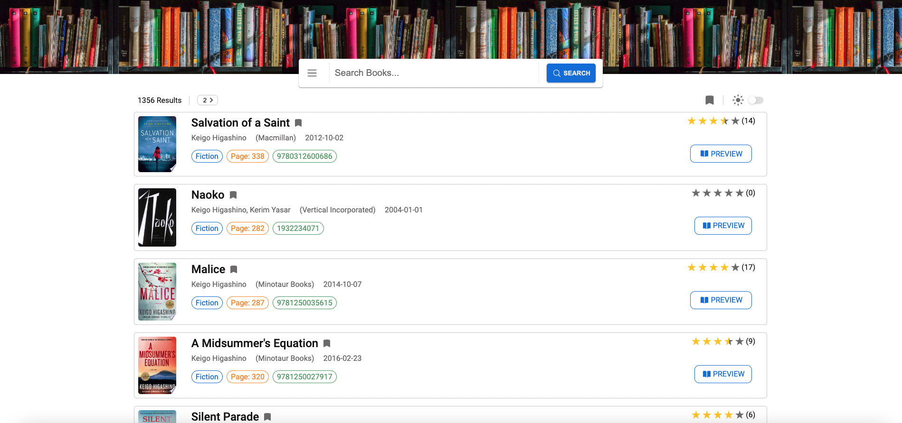

# Bookshelf

This is an online book searching tool based on Google books api. It allows you to search books based on title, author, or publisher. The results list displays some basic info of the books, and you can click on the title or the preview button for more detailed content. This application also has dark mode and bookmark function. Remainder: for demo purpose, this application will only display 40 results maximum. You can easily change this limit in "config.js" once you cloned this repo to your local machine.

Live site: https://zhao-zihan.github.io/bookshelf/

